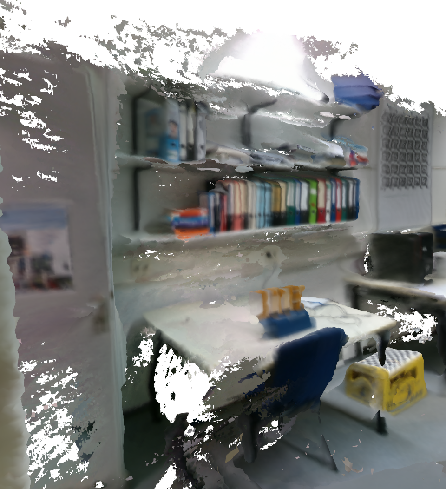
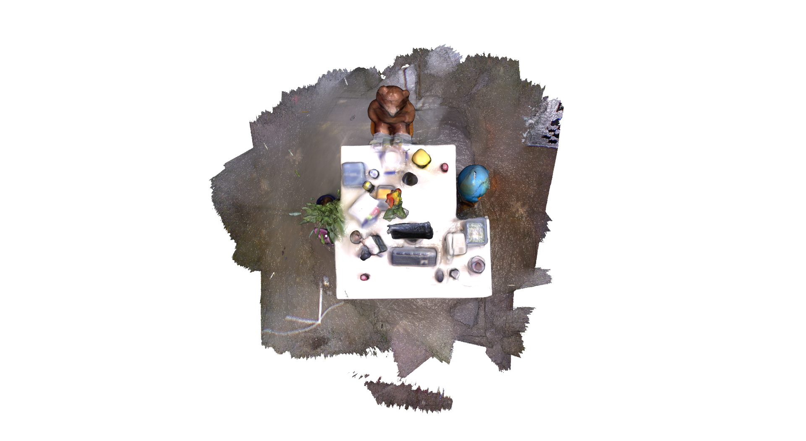

# BAMapping
This framework can reconstruct 3D scenes from RGB-D images.

**Author:** Yi Zongyao

**21 May 2020**: Formal version

# 1.Prerequisites

## C++11 Compiler

## OpenCV
OpenCV is used to facilitate feature extraction and matching. Tested with openCV 3.4. Install instructions can be found at: http://opencv.org.
Install the library under: "libs/opencv_libs/" 

## Open3d
We used Open3D to realize volumetric fusion and mesh visualization. Please refer to http://www.open3d.org.
Install the library under: "libs/open3d_lib/" 
## Pangolin
The [Pangolin](https://github.com/stevenlovegrove/Pangolin) is used for sparse point cloud and trajectory visualization.
Install the library under: "libs/pangolin_lib/" 
```bash
#pangolin:
#dependency:
#OpenGL
sudo apt install libgl1-mesa-dev
#Glew
sudo apt install libglew-dev
#CMake
sudo apt install cmake
#Wayland

#pkg-config: 
sudo apt install pkg-config
#Wayland and EGL:
sudo apt install libegl1-mesa-dev libwayland-dev libxkbcommon-dev wayland-protocols

cd Pangolin
mkdir build
cd build
cmake ..
cmake -DCMAKE_INSTALL_PREFIX="../libs/pangolin_lib" --build .
make install
```
## DBoW2
The [DBoW2](https://github.com/dorian3d/DBoW2) library is utilized to detect loop closures.
Install the library under: "libs/dbow_lib/" 

## ORB vocabulary
For loop closure detection, we used the vocabulary file provided in [ORB SLAM2](https://github.com/raulmur/ORB_SLAM2/tree/master/Vocabulary). Download and extract
then put it under "Voc/"

## Ceres Solver
We used [Ceres Solver](http://ceres-solver.org/) to solve non-linear optimization problem. Install instruction can be found at: http://ceres-solver.org/installation.html.
Install the library under: "libs/ceres_libs/" 


# 2.Build

```bash
cd BAMapping/
mkdir build/
cd ./build/
cmake ..
cmake --build .
```
# 3.Deployment
Make sure that the vocabulary file ORBvoc.txt is under "Voc/" and adjust the parameters in 
configuration files! In TUM dataset, camera intrinsics are not always the same.

## ITE dataset
The dataset folders should be organized as:

    
    ITE_dataset/
    ├── depth/                   # depth images
    ├── ir/                      # infra red images
    ├── rgb/                     # color images
    ├── temp/                    # folder to store temporary files 
    ├── cameras.txt              # initial trajectory
    ├── ITE.yaml                 # configuration file
    └── ITE_frontend.yaml        # configuration file for front end    

launch the front end
```bash
cd BAMapping/build/
runFrontendITE ../dataset/some_ITE_dataset/
```
launch the back end
```bash
runBackenITE ../dataset/some_ITE_dataset/
```



## TUM dataset
First associate the dataset according to https://vision.in.tum.de/data/datasets/rgbd-dataset/tools 
and copy the generated file to dataset's path.
The dataset folders should be organized as:

    
    TUM_dataset/
    ├── depth/                   # depth images
    ├── rgb/                     # color images
    ├── temp/                    # folder to store temporary files 
    ├── ass.txt                  # association file 
    ├── TUM.yaml                 # configuration file
    └── TUM_frontend.yaml        # configuration file for front end  
    
launch the front end
```bash
cd BAMapping/build/
runFrontendTUM ../dataset/some_ITE_dataset/
```
launch the back end
```bash
runBackenTUM ../dataset/some_ITE_dataset/
```
